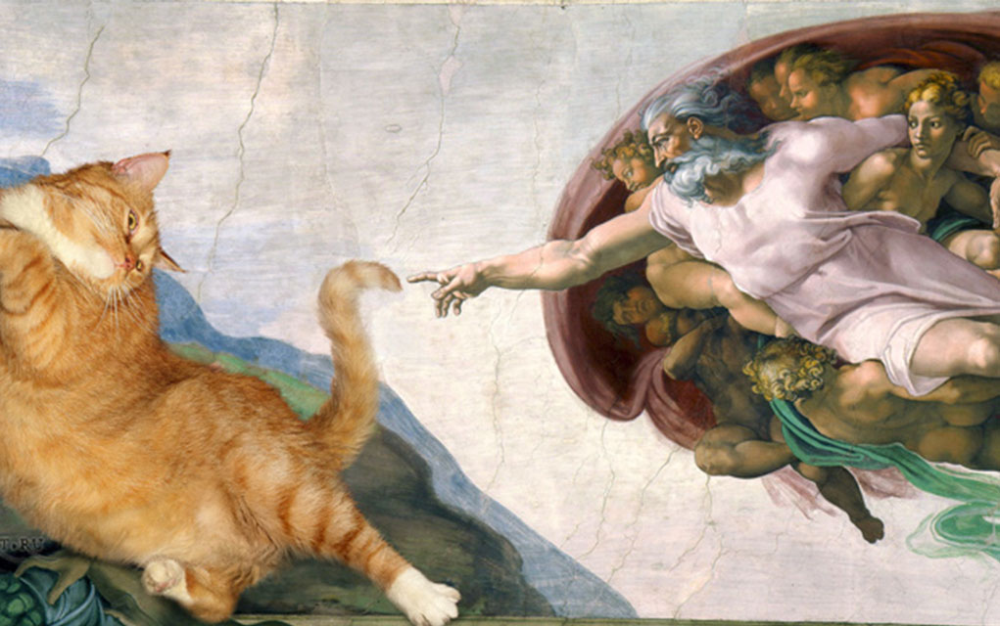

# Проект Новостной сайт **Cats&News**

LICENSE: [MIT](./licence.md)

---

Разработан в качестве практического задания на курсе PHPDEV-30

Сайт не просто про новости, а про кошачьи новости 🐈

## Используемые технологии

- HTML - основная разметка страницы.

- CSS:
    + стили заголовков; 
    + фон для хедера и футера; 
    + корректировка изображений, ссылок и шрифтов;
    + добавление кастомного курсора; 
    + вставка псевдоэлементов и стилей.
---

##### Открыть сайт 
)
