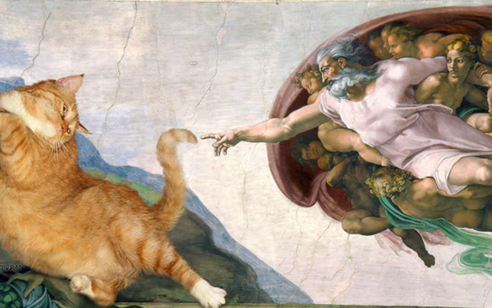

# Проект Новостной сайт **Cats&News**

LICENSE: [MIT](./licence.md)

---

Разработан в качестве практического задания на курсе PHPDEV-30

## Используемые технологии

* HTML

* CSS (Bootstrap)

* JavaScript (jQuery, Popper )

* Web-fonts (Roboto)

## Как открыть/запустить

Зайти в папку сайта в файловом менеджере, кликнуть 2 раза по файлу index.html.